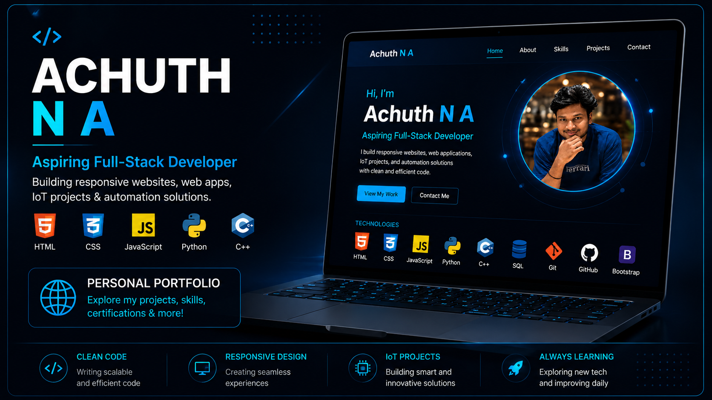
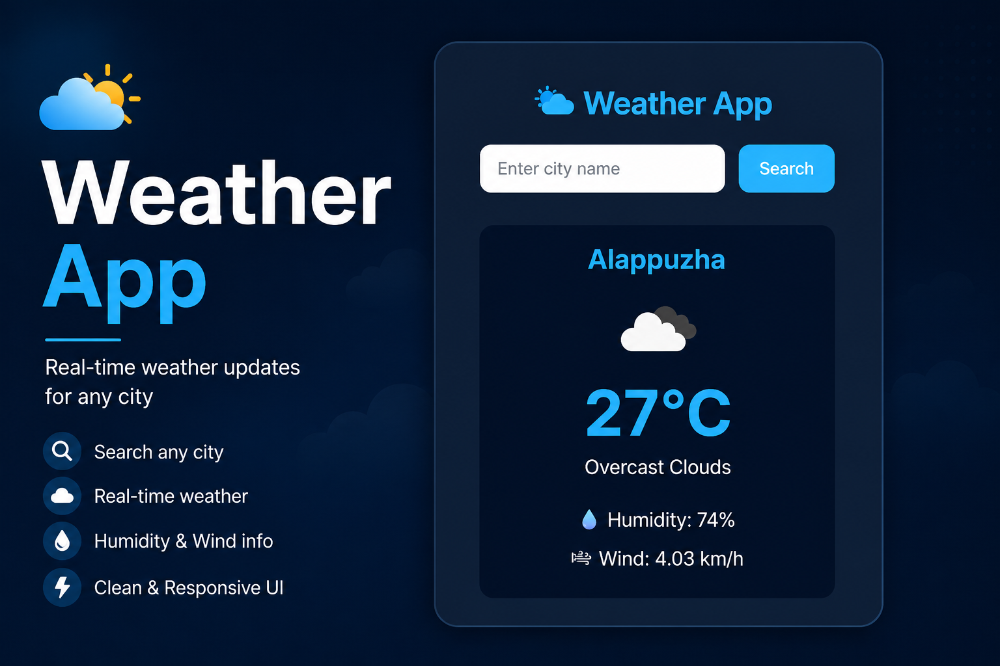

---

## 🚀 About Me

- 🎓 BCA (Honours) student specializing in AI/ML & Data Science
- 💻 Aspiring Full-Stack Developer focused on building practical web applications
- 🤖 Passionate about Artificial Intelligence, IoT, Robotics, and Automation
- 🌱 Currently learning JavaScript, Python, SQL, and Data Structures & Algorithms
- 🚀 Building real-world projects to improve my software development skills
- 🎯 Seeking Software Development Internship opportunities

---

# 💻 Tech Stack

  

### ⚙️ Other Technologies

  
  
  
  
  
  

---

# 🚀 Featured Projects

<table>
<tr>

<td width="50%" valign="top">

<h3 align="center">🌐 Personal Portfolio</h3>

A responsive portfolio showcasing my projects, technical skills, certifications, and achievements.

**Tech Stack**

`HTML` `CSS` `JavaScript`

</td>

<td width="50%" valign="top">

<h3 align="center">🌦️ Weather App</h3>

A responsive weather application that provides real-time weather information using a weather API.

**Tech Stack**

`HTML` `CSS` `JavaScript` `REST API`

</td>

</tr>
</table>

---

# 🤖 ESP32 Surveillance Rover

> 🚧 **Currently In Progress**

An ESP32-powered surveillance rover with live video streaming, Wi-Fi control, and IoT-based remote monitoring.

**Tech Stack**

`ESP32` `Arduino` `IoT` `Embedded Systems`

---

# 📊 GitHub Statistics

  
  

---

# 📫 Connect With Me

